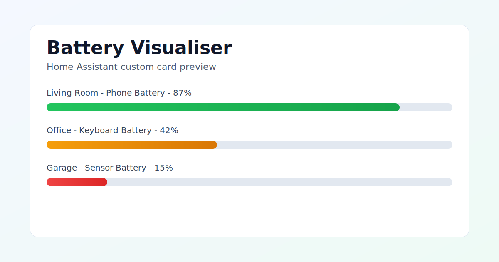

# Battery Visualiser

A Home Assistant Lovelace custom card that visualises battery entities in a clear table with progress bars.



## Features

- Auto-discovers battery entities by default
- Displays area, device name, entity name, and percentage
- Handles unknown and unavailable battery values safely
- Includes a visual Lovelace card editor

## Installation (HACS)

1. Open HACS in Home Assistant.
2. Add this repository as a custom repository with type Dashboard.
3. Install Battery Visualiser and reload Home Assistant resources.
4. Add the card to your dashboard.

## Development

```bash
npm ci
npm run dev
npm run typecheck
npm run build
```

### TypeScript policy

- New runtime and test code should be implemented in TypeScript (`.ts`).
- Keep strict typing enabled and passing via `npm run typecheck`.
- Avoid `any`; prefer explicit interfaces, unions, and type guards.
- Use extensionless local imports in TypeScript source/tests.

### Validation workflow

- `npm run test` runs unit and component tests.
- `npm run typecheck` runs strict TypeScript checks with no emit.
- `npm run build` runs prebuild validation (`test` + `typecheck`) before bundling.
- VS Code tasks include `Typecheck`, `Build`, `Build Release`, and `Validate`.

## Release process

- The release workflow builds assets and publishes `dist/*` as release files.
- HACS validation runs in the release workflow and removes the release automatically if validation fails.
